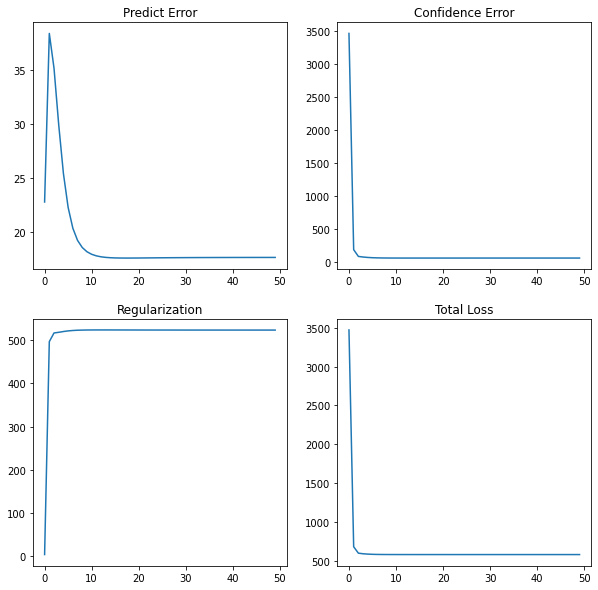

* Result:

    

```text
# Original Datas
    R = np.array([[0,0,0,4,4,0,0,0,0,0,0],
                  [0,0,0,0,0,0,0,0,0,0,1],
                  [0,0,0,0,0,0,0,1,0,4,0],
                  [0,3,4,0,3,0,0,2,2,0,0],
                  [0,5,5,0,0,0,0,0,0,0,0],
                  [0,0,0,0,0,0,5,0,0,5,0],
                  [0,0,4,0,0,0,0,0,0,0,5],
                  [0,0,0,0,0,4,0,0,0,0,4],
                  [0,0,0,0,0,0,5,0,0,5,0],
                  [0,0,0,3,0,0,0,0,4,5,0]])
```

```text
# Final predict
[array([[ 0.        ,  0.70250538,  0.63138903,  0.89263446,  0.87554557,
        -0.06472476,  0.45502002,  0.72209629,  0.83983035,  0.74873292,
         0.17195049],
       [ 0.        ,  0.37351214,  0.47164687,  0.04524012,  0.11288592,
         0.46384458, -0.0601156 ,  0.14395058,  0.09804115, -0.00375897,
         0.56218179],
       [ 0.        ,  0.42000935,  0.39457137,  0.63501518,  0.57799793,
         0.00393157,  0.76273406,  0.62404563,  0.65344706,  0.90566633,
         0.12143765],
       [ 0.        ,  0.94694867,  0.95303299,  0.90849013,  0.93290405,
         0.28282825,  0.482276  ,  0.83330632,  0.90539913,  0.79946928,
         0.5776057 ],
       [ 0.        ,  0.88075202,  0.95087968,  0.57741176,  0.65959578,
         0.50751407,  0.08981368,  0.57034704,  0.59684965,  0.34551241,
         0.77708279],
       [ 0.        ,  0.15393202,  0.12665283,  0.4636477 ,  0.36939892,
        -0.08674318,  0.91105665,  0.50952321,  0.50417646,  0.95422295,
        -0.06307545],
       [ 0.        ,  0.76525959,  0.89964526,  0.28990159,  0.39559215,
         0.7076391 , -0.01872097,  0.39407013,  0.35528723,  0.1471964 ,
         0.92435213],
       [ 0.        ,  0.52262096,  0.71028666, -0.07153354,  0.04290733,
         0.83051463, -0.11592636,  0.14643957,  0.03812606, -0.07688247,
         0.95474411],
       [ 0.        ,  0.15393202,  0.12665283,  0.4636477 ,  0.36939892,
        -0.08674318,  0.91105665,  0.50952321,  0.50417646,  0.95422295,
        -0.06307545],
       [ 0.        ,  0.64399791,  0.58033981,  0.9013189 ,  0.85459834,
        -0.06500351,  0.71260424,  0.78505942,  0.87632659,  0.96937097,
         0.14002817]])]
```