# Machine Learning 
## Index
* [Machine Learning](#machine-learning)
* [Supervised Learning](#supervised-learning)
    * [Linear Regression](#linear-regression)
    * [Binary Classification](#binary-classification)
    * [Multinomial Classification](#multinomial-classification)
* [Application & Tips](#application--tips)

---

## Machine Learning
> "Field of study that gives computers the ability to learn without being explicitly programmed" Arthur Samuel (1959)

* 개발자가 explicit하게 작성한 프로그램은 한계가 있음:
    * Spam filter: many rules
    * Automatic driving: TOO many rules

* 어떠한 프로그램(ML)이 explicit하게 작성하지 않고도 주어진 <b>데이터</b>를 통해 <b>학습</b>하여 유의미한 <b>결과</b>를 도출

* Machine Learning은 크게 두 가지로 분류할 수 있음:
    * Label 유무에 따라 구분됨
    * Supervised learning (regression) : learning with labeled examples
    * Unsupervised learning (clustering) : un-labeded data

## Supervised Learning
* Types of supervised learning
    * Predicting final exam score based on time spent (<b>regression</b>)
    * Pass/non-pass based on time spent (<b>binary classification</b>)
    * Letter grade (A, B, C, E, and F) based on time spent (<b>multi-label classification</b>)

### Linear Regression
* 1차 함수를 사용하여 data를 어떻게 fitting할 것인가?
    * <i>y</i> = <i>Wx</i> + <i>b</i>라는 model이 주어졌을 때, <i>W</i>와 <i>b</i>를 어떻게 최적화할 것인가?
* Linear regression의 사용 목적은 임의의 data를 model에 넣었을 때 결과를 prediction하기 위함

1. Hypothesis

    

2. Cost/loss function

    

    * 비용이 클수록(함수의 결과가 클수록) 평균과 차이가 크다는 뜻
    * 평균으로 가기 위한 비용이 많이 발생한다는 뉘앙스

3. Goal (Algorithm): Gradient Descent Algorithm
* 동작 과정: 
    1. Make convex function(MSE equation)

        

        * Linear regression에서 사용하는 cost function은 convex하게 모양이 잘 나옴
        * 그러나 cost function이 복잡해지면 cost function을 convex하게 만들기 어려움
            * 'local minima' problem에 빠질 수 있음
            * 해당 문제를 해결하는 방법은 오늘날에도 활발히 연구되고 있는 분야
    
    2. <i>W</i>, <i>b</i>에 대해 편미분
    3. <i>W</i>, <i>b</i> 갱신(update)

        

        

        

        

### Binary Classification
* Logistic regression 또는 logistic classification으로도 불림
* Linear regression의 hypothesis 값은 -∞에서부터 ∞까지 광범위하게 분포할 수 있고, 이는 classification에 매우 불리함 (linear regression)
* Binary classification 시 Sigmoid function 사용해 값의 범위를 압축해 위 문제를 해결함과 동시에 classification을 성공적으로 할 수 있음 (logistic classification)

    

    * Linear regression에서의 hypothesis를 사용하면 classification 시 발생할 수 있는 문제

1. Hypothesis
    * 값의 범위를 0~1로 압축
    * Sigmoid (logistic function)

        

        * <i>x</i>의 자리에 random weight <i>W</i>와 input data <i>X</i>를 넣어 사용함
        * <i>f</i>(<i>x</i>) = <i>f</i>(<i>XW</i>)

2. Cost/loss function (logistic cost)
    * Linear regression에서는 convex가 잘 형성됨
    * Sigmoid 함수는 convex가 잘 형성되지 않음
    * Convex 함수 판별:
        * <i>f</i>(<i>tx</i> + (1 - <i>t</i>)<i>y</i>) ≤ <i>tf</i>(<i>x</i>) + (1 - <i>t</i>)<i>f</i>(<i>y</i>)

            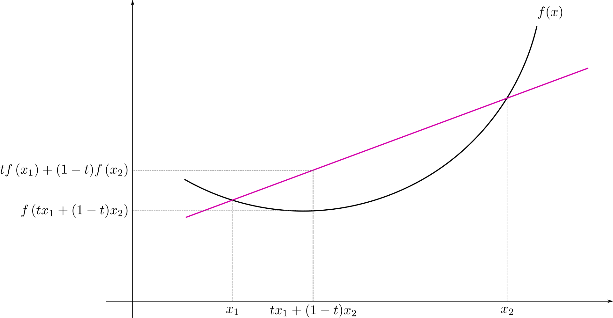
    
    * Logistic classification 함수를 MSE equation에 대입한 결과를 보면 convex하지 않음:

        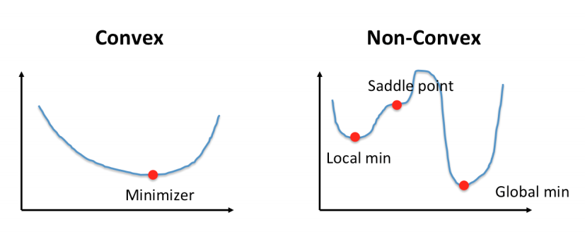

        * <b>Convex하지 않은 함수는 여러 극점이 존재</b>하며, gradient descent algorithm을 적용하면 목표인 global minimum을 찾지 못하고 local minima에 도달하거나 saddle point에 도달할 수 있음
        * 결국 올바른 결과를 반환할 수 없으며, <b>새로운 cost function</b>이 필요함
    
    * 새로운 cost function

        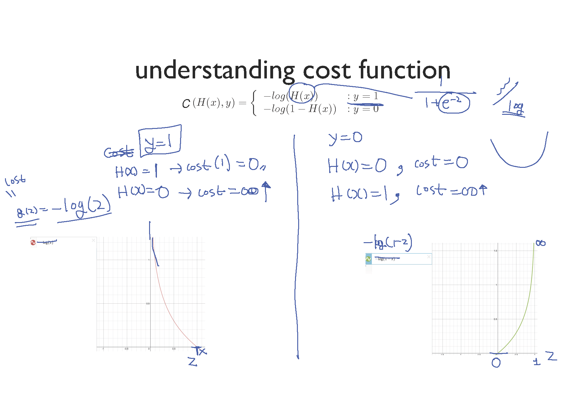

        * If condition을 제거한 cost function은 아래와 같음:

            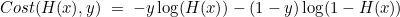

3. Goal: Gradient Descent Algorithm
* 동작 과정:
    1. Make convex function(via using log function)
    2. 편미분
    3. Update variables
    4. Prediction

        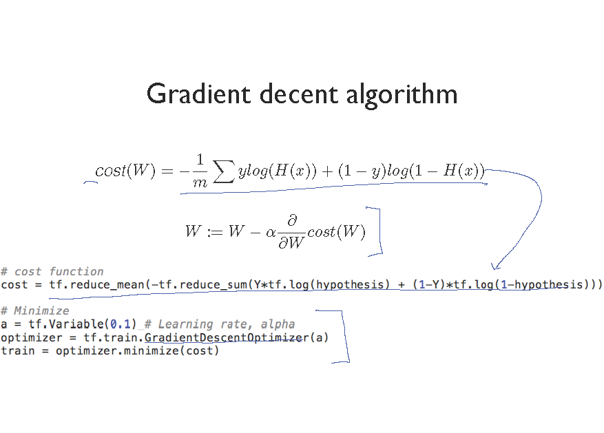

### Multinomial Classification
* Softmax classification, softmax regression으로도 불림
* 두 개 이상의 분류 기법

    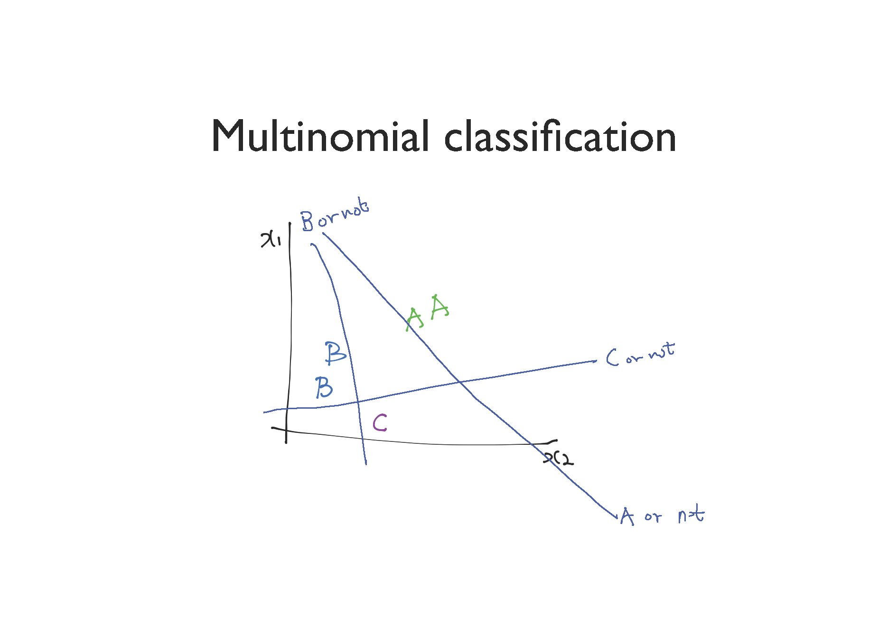

* 세 개의 독립적인 모델을 사용해 각각 학습시킬 수 있으나, 해당 방법은 <b>복잡함</b>
    * 새로운 방법 필요

* 새로운 분류기법 (softmax):

    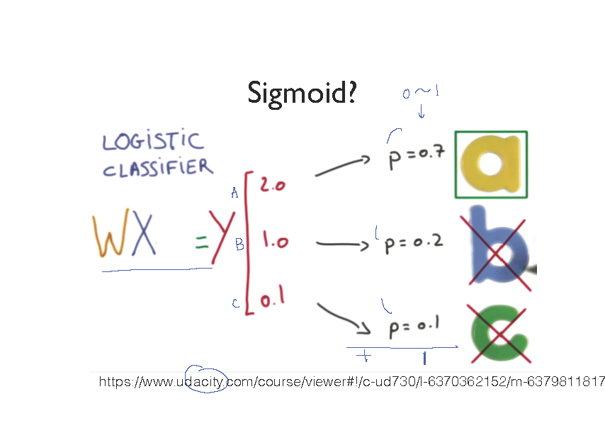

    * <b>Sigmoid는 값의 범위를 0~1 압축하는 데 사용했다면, softmax는 값을 확률로 변환</b>

    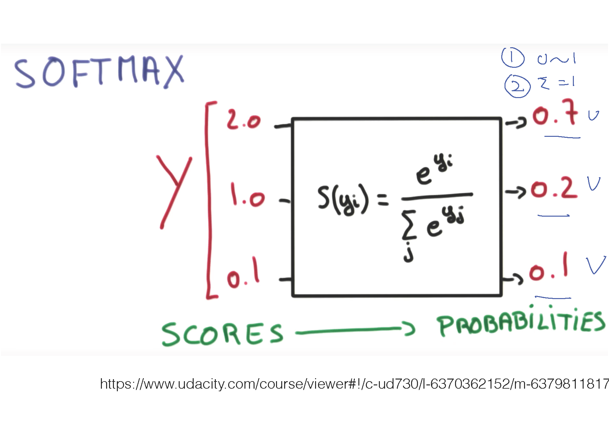

    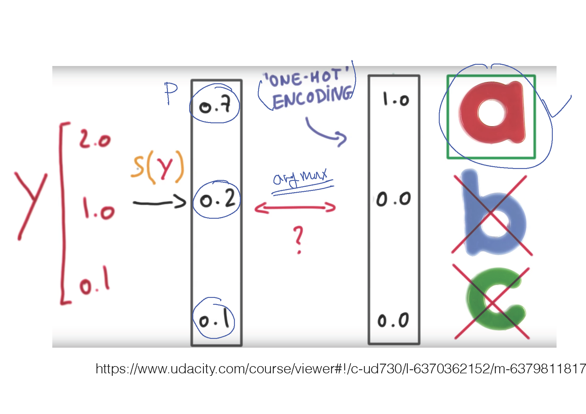

1. Hypothesis

    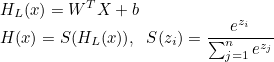

2. Cost/loss function (cross-entropy)

    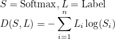

    * Sigmoid를 사용한 cost function(logistic cost, <i>C</i>)와 softmax를 사용한 cost function(cross-entropy, <i>D</i>)는 <b>동일</b>
    * <i>C</i>(<i>H</i>(<i>x</i>), <i>y</i>) vs. <i>D</i>(<i>S</i>, <i>L</i>):

        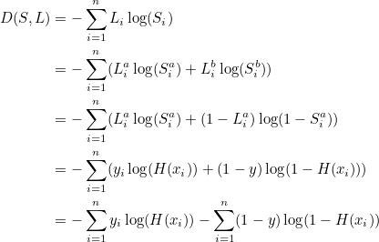

3. Goal
    1. Make convex function
    2. 편미분
    3. Update variables
    4. Prediction

## Application & Tips
* Learning rate
    * 너무 작다면 local minima에 빠지거나 학습 속도가 너무 오래 걸림
    * 너무 크다면 overshooting
    * 해결방안:
        * 여러 learning rate를 설정해 갱신(update)되는 변수들의 변화를 지켜봄
        * 갱신되는 변수들이 너무 느리게 변화한다면 learninig rate를 키움
        * 갱신되는 변수들이 너무 빠르게(발산) 변화한다면 learninig rate를 줄임
        * 일반적으로 사용하는 learning rate는 0.01

* 데이터 전처리(data preprocessing for gradient descent)
    * 데이터 전처리가 이루어지지 않는다면, 아래 경우에서 learning rate가 작더라도 overshooting될 수 있음:

        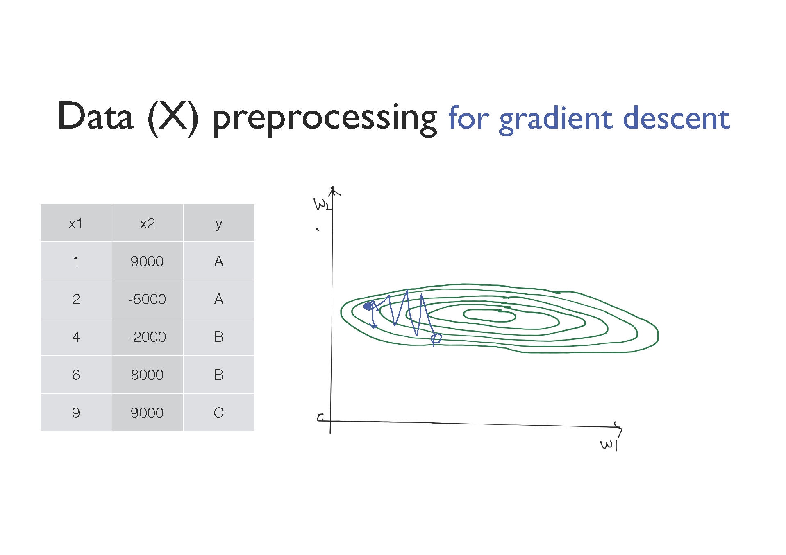
    
    * learning rate를 아무리 조정해도 학습이 잘 되지 않는다면, data preprocessing이 필요함:

        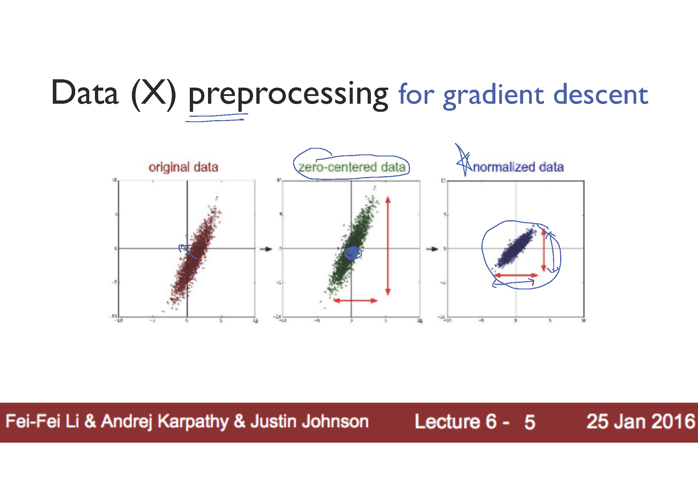

        1. original data를 가져온다.
        2. data들을 zero-centered한다. (standardization)

            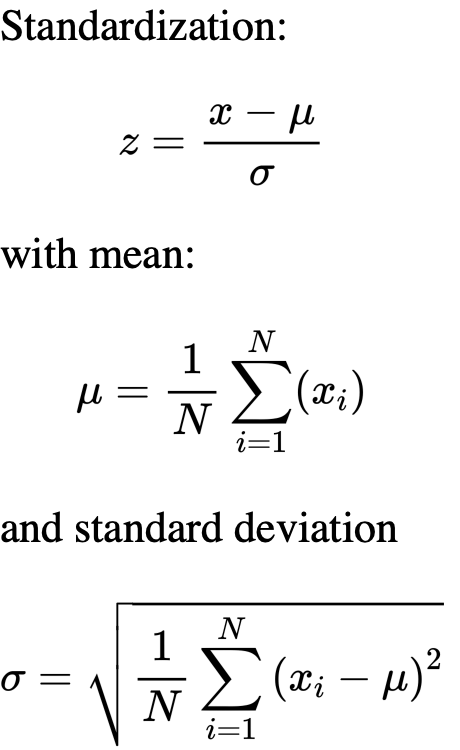

        3. data들을 normalized한다. (min-max scaling)

            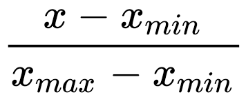
    
* 과적합(Overfitting)
    * 학습 데이터에 model이 과하게 fitting된 상태

        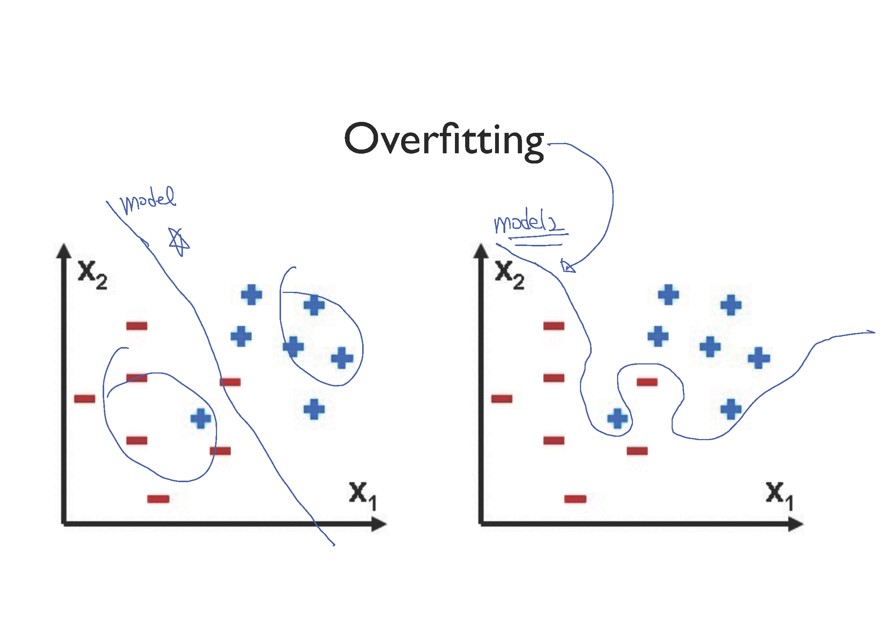

    * 해결방안:
        1. 많은 양의 학습 데이터 사용
        2. feature의 개수를 줄임 (model을 단순화)
        3. <b>Regularization</b>

            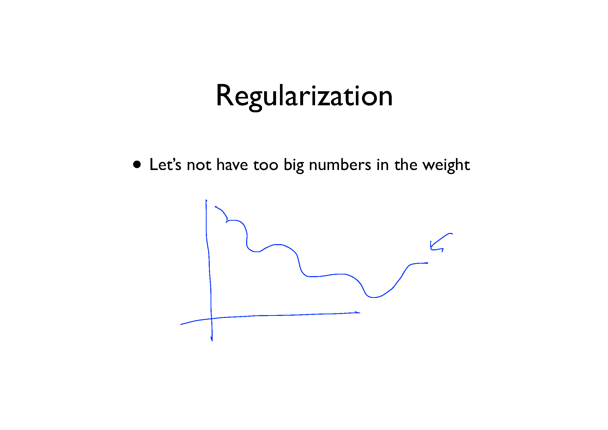

            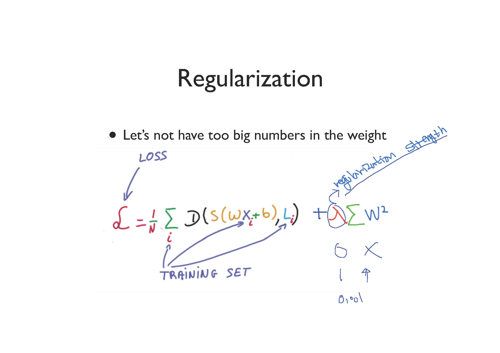

            * <i>W</i>의 값이 너무 큰 값을 가지지 못하도록 조절하는 기능
            * Weight가 작아질수록 cost function의 형태는 단순해짐
            * λ의 값을 0으로 사용한다면 regularization을 사용하지 않음을 의미
            * λ의 값을 1로 사용한다면 regularization을 강하게 사용하겠다는 의미
            * 보통 λ의 값을 0~1 사이에 두고 사용

* 성능 평가
    * 설계한 model이 과연 좋은 성능을 내는가?
    * 학습 데이터가 있을 때, 모든 학습 데이터를 사용해 model을 학습하면 당연히 좋은 성능을 낼 수 밖에 없음:

        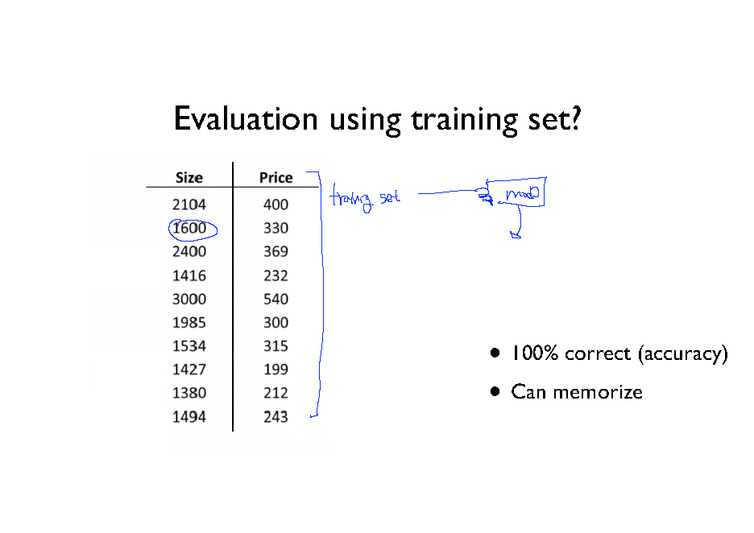

    * 학습 데이터 중 일부는 학습에 이용하지 않고, model의 성능 평가에만 사용해야 함:

        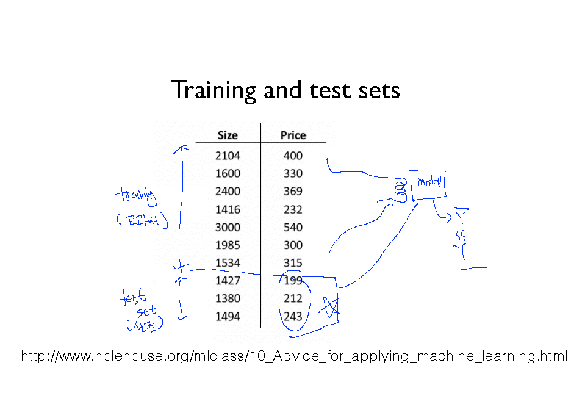

        * Model 평가 방법:
            1. 평가 시 학습 데이터를 training data set, validation set으로 구분함
            2. Training data set을 사용해 model 학습
            3. Validation set을 사용해 model을 모의 평가함:
                1. Overfitting 여부 확인
                2. Accuracy(validation set의 data를 넣었을 때의 prediction 값과 해당 data의 label 비교 후 일치여부 확인) 확인 후 learning rate, regularization 조절
            4. Prediction 결과와 실제 데이터를 비교해 Accuracy 확인

    * [Training, Validation and test sets](https://towardsdatascience.com/train-validation-and-test-sets-72cb40cba9e7):

        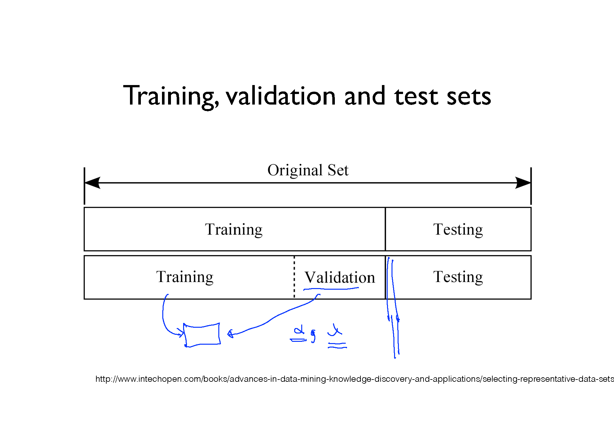

        * 보통 학습 데이터의 70% 정도를 training data set으로, 30% 정도를 validation set으로 사용
        * Validation set과 testing set은 절대 학습해서는 안됨
            * Validation set은 학습 중인 model의 accuracy를 판단해 과적합 등의 문제를 해결하거나 여러 model 중 가장 좋은 성능을 보이는 model을 선택할 때 사용
            * 가장 우수한 model을 선택하는 것이 아니라면, validation set을 통한 accuracy 결과를 보고 learning rate 또는 ragularization 등의 parameter를 조정할 수 있음
            * testing set은 학습이 완료된 model(여러 번 training set을 통해 학습하고 validation set을 통해 parameter을 조정하여 가장 우수한 model을 선택)에 unseed data를 사용해 accuracy를 구하는 데 사용
    
    * 학습 데이터 양이 너무 많을 경우 online learning을 사용:

        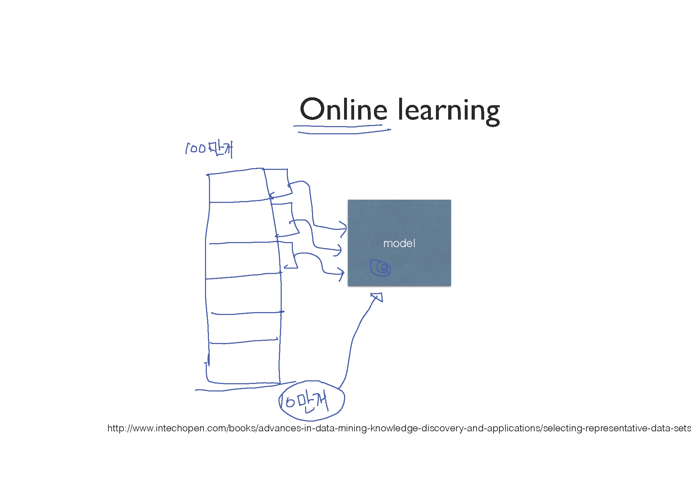

        * 학습 데이터를 나누어 학습하는 방법
        * 예를 들어, 100만 건의 학습 데이터가 있다면 10만 건씩 데이터를 나누어 학습
            * 10만 건 데이터를 먼저 model에 학습시킨 결과가 model에 기록되어 있는 상태에서 다음 10만 건 데이터를 학습
        * 후에 학습 데이터가 추가되었을 때, model에 이미 이전 학습 데이터의 결과가 기록되어 있기 때문에 추가된 데이터만 학습하면 됨
