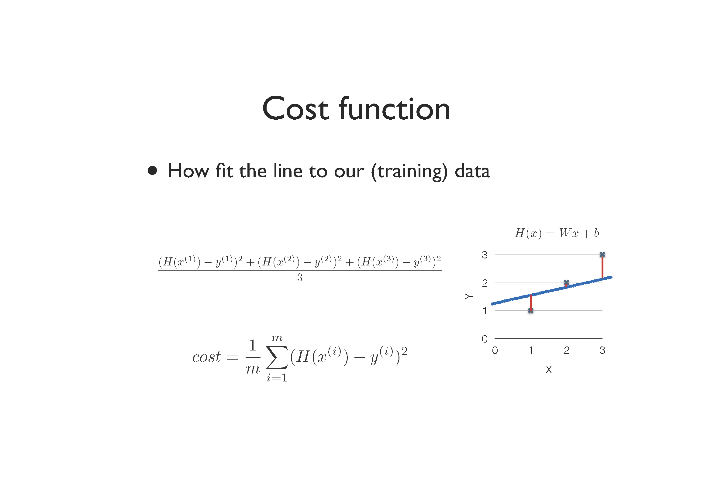
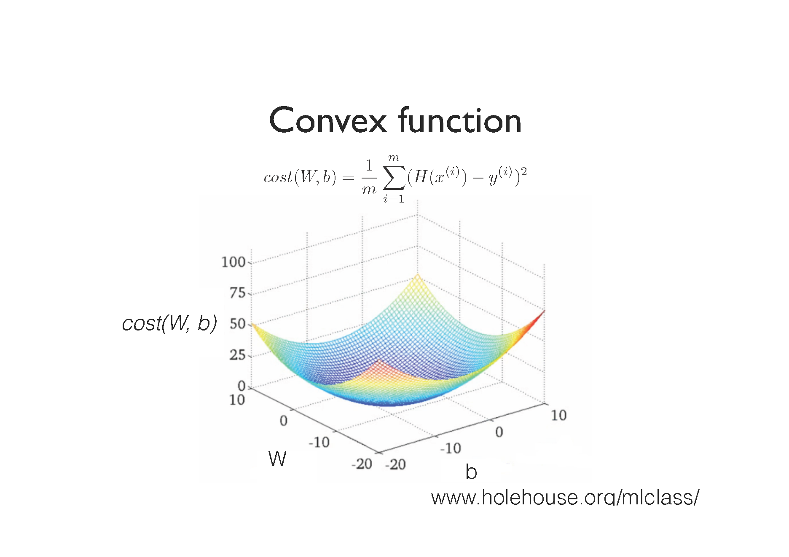
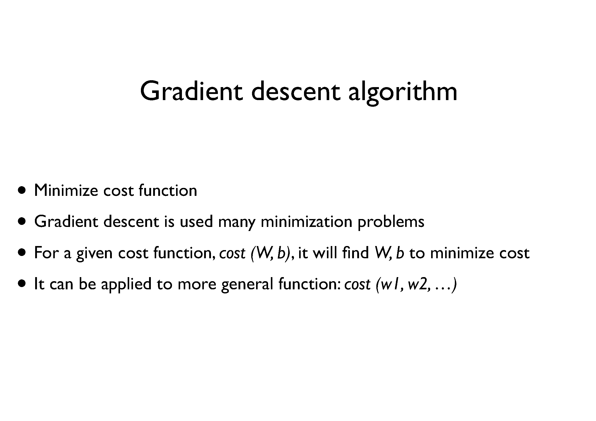
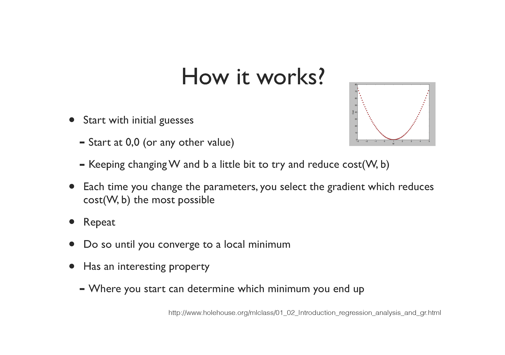
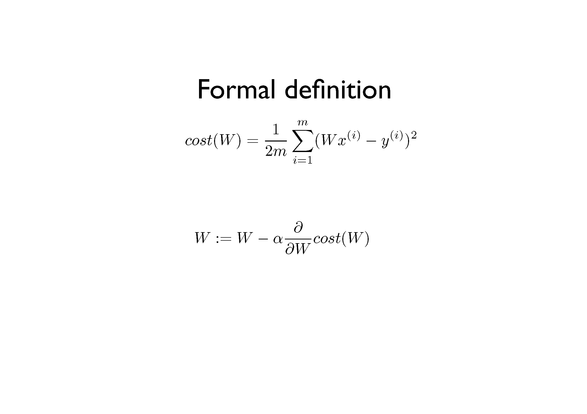
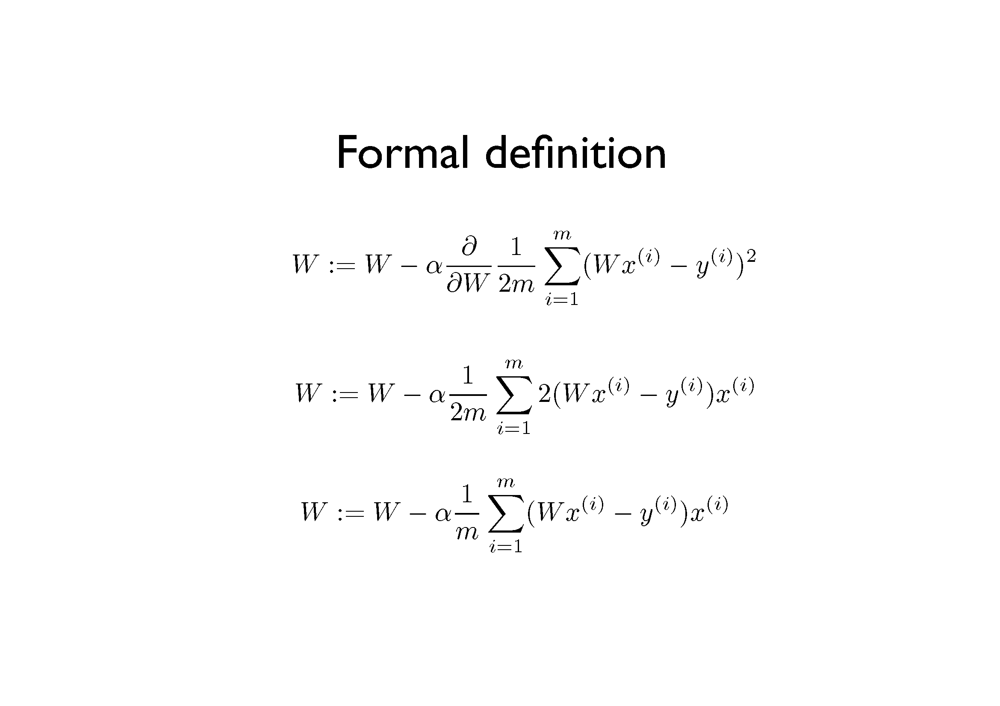
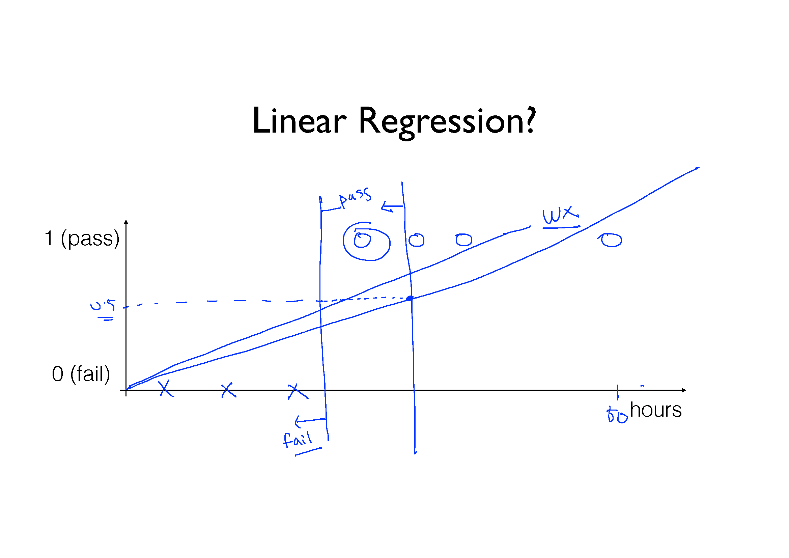
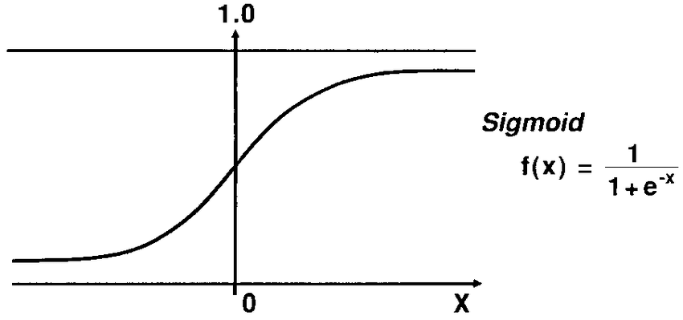

# Machine Learning 
## Index
* [Machine Learning](#machine-learning)
    * [Supervised Learning](#supervised-learning)
        * Linear Regression
        * Binary Classification
        * Multi-label Classification
    * [Unsupervised Learning](#unsupervised-learning)

---

## Machine Learning
> "Field of study that gives computers the ability to learn without being explicitly programmed" Arthur Samuel (1959)

* 개발자가 explicit하게 작성한 프로그램은 한계가 있음:
    * Spam filter: many rules
    * Automatic driving: TOO many rules

* 어떠한 프로그램(ML)이 explicit하게 작성하지 않고도 주어진 <b>데이터</b>를 통해 <b>학습</b>하여 유의미한 <b>결과</b>를 도출

* Machine Learning은 크게 두 가지로 분류할 수 있음:
    * Label 유무에 따라 구분됨
    * Supervised learning (regression) : learning with labeled examples
    * Unsupervised learning (clustering) : un-labeded data

### Supervised Learning
* Types of supervised learning
    * Predicting final exam score based on time spent (<b>regression</b>)
    * Pass/non-pass based on time spent (<b>binary classification</b>)
    * Letter grade (A, B, C, E, and F) based on time spent (<b>multi-label classification</b>)

#### Linear Regression (in supervised learning)
* 1차 함수를 사용하여 data를 어떻게 fitting할 것인가?
    * <i>y</i> = <i>Wx</i> + <i>b</i>라는 model이 주어졌을 때, <i>W</i>와 <i>b</i>를 어떻게 최적화할 것인가?
* Linear regression의 사용 목적은 임의의 data를 model에 넣었을 때 결과를 prediction하기 위함

1. Hypothesis

    

2. Cost/loss function

    

    * 비용이 클수록(함수의 결과가 클수록) 평균과 차이가 크다는 뜻
    * 평균으로 가기 위한 비용이 많이 발생한다는 뉘앙스

3. Goal (Algorithm): Gradient Descent Algorithm
* 동작 과정: 
    1. Make convex function(model을 제곱)

        

        * Linear regression에서 사용하는 cost function은 convex하게 모양이 잘 나옴
        * 그러나 cost function이 복잡해지면 cost function을 convex하게 만들기 어려움
            * 'local minima' problem에 빠질 수 있음
            * 해당 문제를 해결하는 방법은 오늘날에도 활발히 연구되고 있는 분야
    
    2. <i>W</i>, <i>b</i>에 대해 편미분
    3. <i>W</i>, <i>b</i> 갱신(update)

        

        

        

        

#### Binary Classification (in supervised learning)
* Linear regression의 hypothesis 값은 -∞에서부터 ∞까지 광범위하게 분포할 수 있고, 이는 classification에 매우 불리함 (linear regression)
* Binary classification 시 Sigmoid function 사용해 값의 범위를 압축해 위 문제를 해결함과 동시에 classification을 성공적으로 할 수 있음 (logistic classification)

    

    * Linear regression에서의 hypothesis를 사용하면 classification 시 사용할 수 있는 문제

1. Hypothesis
    * 값의 범위를 0~1로 압축
    * Sigmoid (logistic function)

        

        * <i>x</i>의 자리에 random weight <i>W</i>와 input data <i>X</i>를 넣어 사용함
        * <i>f</i>(<i>x</i>) = <i>f</i>(<i>XW</i>)

2. Cost/loss function (logistic cost)
    * Linear regression에서는 convex가 잘 형성됨
    * Sigmoid 함수는 convex가 잘 형성되지 않음

3. Goal: Gradient Descent Algorithm
