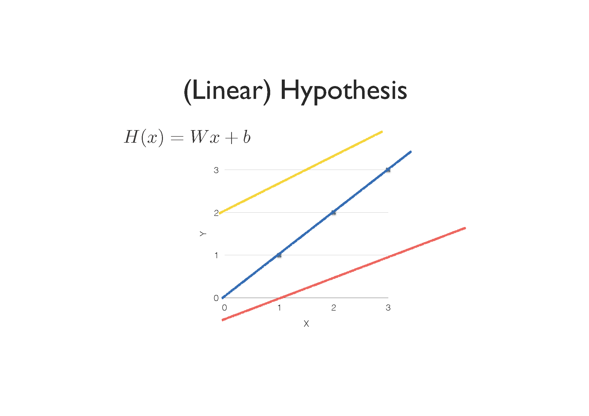

# Machine Learning 
## Index
* [Machine Learning](#machine-learning)

---

## Machine Learning
> "Field of study that gives computers the ability to learn without being explicitly programmed" Arthur Samuel (1959)

* 개발자가 explicit하게 작성한 프로그램은 한계가 있음:
    * Spam filter: many rules
    * Automatic driving: TOO many rules

* 어떠한 프로그램(ML)이 explicit하게 작성하지 않고도 주어진 <b>데이터</b>를 통해 <b>학습</b>하여 유의미한 <b>결과</b>를 도출

* Machine Learning은 크게 두 가지로 분류할 수 있음:
    * Label 유무에 따라 구분됨
    * Supervised learning (regression) : learning with labeled examples
    * Unsupervised learning (clustering) : un-labeded data

### Supervised Learning
* Types of supervised learning
    * Predicting final exam score based on time spent (<b>regression</b>)
    * Pass/non-pass based on time spent (<b>binary classification</b>)
    * Letter grade (A, B, C, E, and F) based on time spent (<b>multi-label classification</b>)

#### Linear Regression (in supervised learning)
* 1차 함수를 사용하여 data를 어떻게 fitting할 것인가?
    * <i>y</i> = <i>Wx</i> + <i>b</i>라는 model이 주어졌을 때, <i>W</i>와 <i>b</i>를 어떻게 최적화할 것인가?
* Linear regression의 사용 목적은 임의의 data를 model에 넣었을 때 결과를 prediction하기 위함

1. Hypothesis

    

